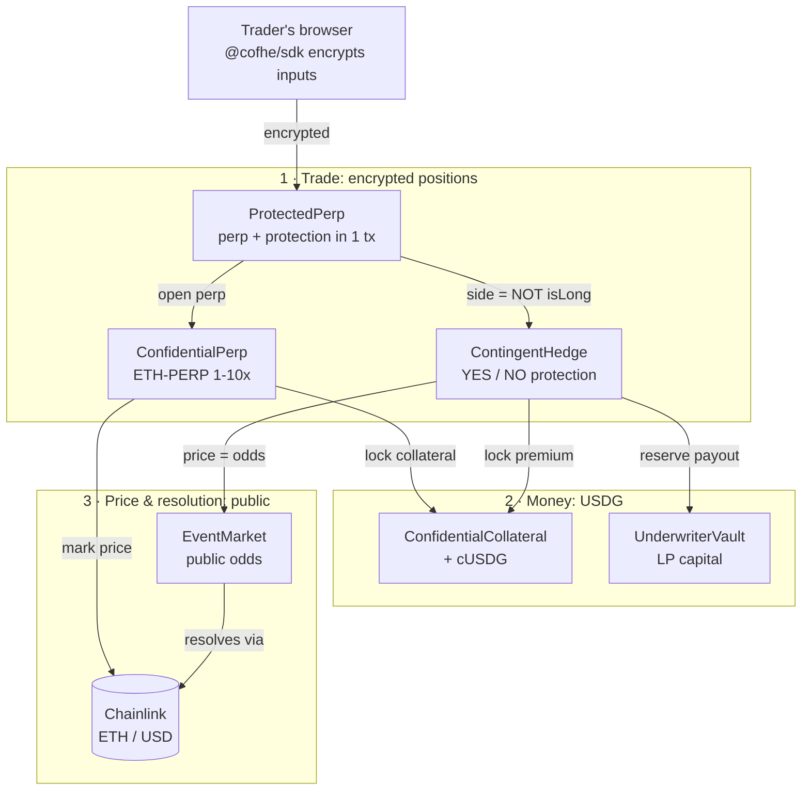

# Contingent

**Leverage with a capped crash. Fully encrypted.**

Contingent is a confidential derivatives protocol on Arbitrum. Traders open **leveraged ETH perps** and, in the
**same transaction**, buy **protection from a public prediction market**. A liquidation that would wipe out the
position becomes a small, known premium. Every position is **encrypted with Fhenix FHE**, so nobody can see its
size, direction, liquidation price or protection. Everything settles in **USDG**.

**Live on Arbitrum Sepolia** · **14 contracts, all source-verified** · **39 Foundry tests passing** · real
Chainlink prices · real FHE encryption (Fhenix CoFHE)

| | |
|---|---|
| 🎬 **Demo video** (3:36) | `<!-- TODO: paste YouTube / Loom link -->` · local file: [`demo-video/contingent-demo-prof.mp4`](demo-video/contingent-demo-prof.mp4) |
| 🌐 **Live app** | `<!-- TODO: paste deployed URL (deploy frontend-prof/) -->` |
| 📜 **Contracts** | [Deployed addresses](#61-deployed-contracts-arbitrum-sepolia--chain-421614) (all verified on Arbiscan) · history in [`DEPLOYMENTS.md`](DEPLOYMENTS.md) |
| 📖 **Explainer** | [`hedging-explained.html`](hedging-explained.html): hedging a perp with a prediction market, with worked numbers |
| 🧪 **Try it yourself** | [`STEPS.md`](STEPS.md): click-by-click walkthrough of every tab |

---

## Contents

1. [The problem](#1-the-problem)
2. [The solution](#2-the-solution)
3. [How the protection works (worked example)](#3-how-the-protection-works)
4. [What's live](#4-whats-live)
5. [Privacy model: what is hidden, what is public](#5-privacy-model)
6. [Architecture](#6-architecture) · [deployed contracts](#61-deployed-contracts-arbitrum-sepolia--chain-421614)
7. [Tech stack & integration status](#7-tech-stack--integration-status)
8. [Market fit](#8-market-fit)
9. [Roadmap & milestones](#9-roadmap--milestones)
10. [Judging criteria](#10-judging-criteria)
11. [Run it locally](#11-run-it-locally)
12. [Repository layout](#12-repository-layout)
13. [Security, limits & honest caveats](#13-security-limits--honest-caveats)
14. [Further reading](#14-further-reading)

---

## 1. The problem

**On-chain leverage is fully public, and that makes crashes worse.**

- On today's on-chain perp venues, **every position's size, side and liquidation price can be read by anyone**.
  In a sharp move, that map of liquidation levels tells other traders exactly where forced selling will happen,
  so cascades and stop-hunts feed on it. On 10 Oct 2025, more than **$19B** of leveraged positions were reported
  liquidated in a single day.
- **Traders have no simple way to insure a leveraged position.** Options are fragmented, hard to price and
  rarely available on-chain for the exact scenario that liquidates you.
- **Prediction markets already price exactly these scenarios** ("will ETH be above $2,500?"), but they are
  **public too**. Buying protection there reveals the direction of your real position.

## 2. The solution

Contingent combines three things in one product:

| | What it does | Why it matters |
|---|---|---|
| **Encrypted perps** | ETH-PERP, 1–10x, against a house liquidity pool. Collateral, size and direction are FHE ciphertexts | Nobody can see your position or compute your liquidation price, so there is nothing to hunt |
| **Prediction-market protection** | A binary YES/NO event market prices "ETH ≥ strike at expiry". A long buys **NO**, a short buys **YES** | The crash that liquidates you pays out the protection. The market's odds *are* the premium, so no volatility model is needed |
| **One transaction, direction hidden** | `ProtectedPerp` opens the perp **and** its protection atomically. The protection side is computed **on the ciphertext** (`isYes = FHE.not(isLong)`) | Even the protection can't leak which way you're positioned |

Around it: **LPs underwrite the event market** (they earn the premiums), **keepers** run liquidation checks and
settlement, and **Chainlink** resolves the event and prices the perp.

## 3. How the protection works

The exact trade from the demo: **LONG ETH 5x**, **100 USDG** collateral (size 500), entry ≈ $2,720, liquidation
≈ $2,203 (5% maintenance). Protection: **NO** on "ETH ≥ $2,500", cover **100**, at YES odds 65%, so the
premium is **35 USDG**.

| ETH at resolution | Perp alone | NO protection | **Protected** |
|---|---:|---:|---:|
| Rallies +8% ($2,938) | +40 | −35 | **+5** |
| Flat ($2,720) | 0 | −35 | **−35** |
| Falls below strike ($2,400) | −59 | +65 | **+6** |
| Crash, liquidated ($2,150) | **−100** | +65 | **−35** |

**Read the last row:** a wipe-out of −100 becomes a known −35, which is the premium. You give up a slice of
upside (+40 → +5) to cap the tail. That trade is what hedging *is*, and the public market sets the price.

**Honest limits:** the event resolves **once**, at expiry. A crash that liquidates you and then recovers above
the strike loses on both legs (−135). The cover pays a **fixed** amount, not your exact loss (basis risk). Size
the cover to your liquidation loss and pick a strike near your liquidation price.

## 4. What's live

Everything below runs against the deployed contracts on Arbitrum Sepolia, and every step is shown in the demo video.

| Tab | Features |
|---|---|
| **PERPS** | Wrap USDG to confidential cUSDG → deposit as encrypted collateral · **👁 Reveal**: your balance decrypted *only in your browser*, next to the ciphertext handle everyone else sees · open LONG/SHORT 1–10x · **🛡 Open protected position** (perp + event protection in one tx) · positions **masked by default** with per-position reveal · **Close both** (perp settles through async decrypt, protection premium refunded) · keeper **liquidation check** that reveals **one bit** only |
| **MARKET** | The public prediction market: live odds, YES/NO pools, stake to move the odds · live Chainlink ETH/USD chart with the **YES / NO zones** around the strike and a "distance to strike" readout · premium calculator |
| **HEDGE** | Open an **encrypted binary derivative** directly (YES/NO, notional) with a live payoff chart · your hedges list |
| **UNDERWRITE** | LPs deposit USDG into the underwriter vault, which is the counterparty to every hedge · reserve book (total, earmarked, free, paid out) |
| **SETTLE** | Resolve the event from Chainlink → settle a position (only the **winning payout** is decrypted) → sweep premiums to LPs (only the **aggregate** is decrypted) → finalise and release capacity |

Verified end to end: an automated live-chain test (`frontend/scripts/live-e2e.mjs`), a browser E2E
(`frontend/scripts/ui-e2e.mjs`), a manual MetaMask click-through of every tab, and the recorded demo takes.
All of them run real transactions and real FHE on Arbitrum Sepolia.

## 5. Privacy model

The honest boundary: what's encrypted, what's public, and what gets revealed and when.

| Data | On-chain | Revealed when |
|---|---|---|
| Perp collateral, size | 🔒 `euint64` | Collateral + final payout: only **after** the position closes (needed to pay out) |
| Perp direction (long/short) | 🔒 `ebool` | Never |
| Liquidation price | 🔒 not computable without size + side | Never. Keepers learn **one bit** ("liquidatable or not") |
| Protection side (YES/NO) & cover | 🔒 `ebool` / `euint64`, side = `FHE.not(isLong)` | Only a **winning** payout, at settlement |
| Hedge size & side | 🔒 `euint64` / `ebool` | Only a **winning** payout, at settlement |
| Your collateral balance | 🔒 cUSDG ciphertext | Only to **you**, decrypted client-side with an EIP-712 permit |
| Leverage, entry price, owner, open time | 🌐 public | — |
| Event odds, YES/NO pools, strike | 🌐 public (they *are* the price) | — |
| Aggregate premiums per event | 🔒 while open | Only the **total**, when swept to LPs |
| Perp ↔ protection link | 🌐 public (`protectionOf(perpId)`) | — |

Premiums are computed **on ciphertext** (`premium = size × p`), and every payout is computed branch-free
(`FHE.select`), so no plaintext comparison ever leaks through gas or control flow. Decryption uses the CoFHE
3-step flow: `allowPublic` → off-chain threshold decrypt → `publishDecryptResult` with an on-chain signature check.

## 6. Architecture



The diagram shows the main path. Every contract, including `SettlementRouter`, `ConfidentialPositionManager`/`PositionNFT`, the resolvers and the Uniswap v4 `EventHook`, is listed below.

| Contract | Role |
|---|---|
| `ConfidentialUSDG` | Confidential USDG wrapper (cUSDG): encrypted balances and transfers |
| `ConfidentialCollateral` | Encrypted collateral vault shared by perps and hedges. Lock/release is clamped to free balance |
| `ConfidentialPerp` | ETH-PERP 1–10x against a house pool. Encrypted OI clamp (collateral ≤ free pool / 5), profit cap 5×, 5% maintenance, 1% keeper bonus, 0.01%/h borrow fee, Chainlink mark with 1h staleness guard |
| `ProtectedPerp` | Opens a perp + its opposite-side event hedge atomically. The protection side is computed on the ciphertext. Stores the link |
| `ContingentHedge` | Encrypted binary derivatives: premium locked first, cover scaled to the premium actually paid, clamped to vault capacity, excess refunded |
| `EventMarket` | Public YES/NO odds market (price discovery). Resolution comes from a pluggable resolver |
| `UnderwriterVault` | LP capital: earmarks capacity per event, encrypted liability accounting, premium pool, payouts |
| `SettlementRouter` | Pays winners from the vault. Optional 1inch swap / Aqua top-up routes (see §7) |
| `ConfidentialPositionManager` · `PositionNFT` | Encrypted hedge positions, transferable as NFTs (the holder is paid) |
| `PriceThresholdResolver` · `ManualResolver` | Chainlink threshold resolution with a deadline, and an attestor fallback |
| `EventHook` | Uniswap v4 hook: freezes an odds pool after resolution and enforces the trading window |

### 6.1 Deployed contracts (Arbitrum Sepolia · chain 421614)

All 14 contracts are source-verified on Arbiscan. Click an address to open it.

| Contract | Role | Address |
|---|---|---|
| **ProtectedPerp** | Perp + event protection in one tx | [`0xf97AA238bA1e462c05863eFa9cc4E13d240Ffb2c`](https://sepolia.arbiscan.io/address/0xf97AA238bA1e462c05863eFa9cc4E13d240Ffb2c) |
| **ConfidentialPerp** | ETH-PERP 1–10x, house pool | [`0x8547089cE2380ec20Ad68c5fff4E661863452718`](https://sepolia.arbiscan.io/address/0x8547089cE2380ec20Ad68c5fff4E661863452718) |
| **ContingentHedge** | Encrypted binary derivatives (orchestrator) | [`0x670b2dC8EEa68Cb6BA2caC4021FCE02b85C51Dcf`](https://sepolia.arbiscan.io/address/0x670b2dC8EEa68Cb6BA2caC4021FCE02b85C51Dcf) |
| **ConfidentialUSDG** | Confidential USDG (cUSDG) | [`0xd8f57E64bc235D4bceF8D2f791BDf46908408F94`](https://sepolia.arbiscan.io/address/0xd8f57E64bc235D4bceF8D2f791BDf46908408F94) |
| **ConfidentialCollateral** | Encrypted collateral vault | [`0x4E4cb1b3B326C79FDFD51E14C26C9bDA7a5F5898`](https://sepolia.arbiscan.io/address/0x4E4cb1b3B326C79FDFD51E14C26C9bDA7a5F5898) |
| **ConfidentialPositionManager** | Encrypted hedge positions | [`0xA39438870296a652A268B7A187C5a540bf89cD36`](https://sepolia.arbiscan.io/address/0xA39438870296a652A268B7A187C5a540bf89cD36) |
| **PositionNFT** | Transferable position NFTs | [`0xA526FADAA46544da9b54EC97Ab7e1B80DE00a542`](https://sepolia.arbiscan.io/address/0xA526FADAA46544da9b54EC97Ab7e1B80DE00a542) |
| **EventMarket** | Public prediction market (odds) | [`0xD81751083861194276BC401Fc94052De0ea3A97a`](https://sepolia.arbiscan.io/address/0xD81751083861194276BC401Fc94052De0ea3A97a) |
| **UnderwriterVault** | LP capital, counterparty | [`0xB73fF66E6768eC894BaF56E48e93dBBaAD745DCf`](https://sepolia.arbiscan.io/address/0xB73fF66E6768eC894BaF56E48e93dBBaAD745DCf) |
| **SettlementRouter** | Winner payouts (+ 1inch routes, off) | [`0xF0573896166052659A90Fa3626A0ff36637353CF`](https://sepolia.arbiscan.io/address/0xF0573896166052659A90Fa3626A0ff36637353CF) |
| **PriceThresholdResolver** | Chainlink event resolution | [`0xd4fa6b3b391Cc75eED61427F08051E219cB46cc4`](https://sepolia.arbiscan.io/address/0xd4fa6b3b391Cc75eED61427F08051E219cB46cc4) |
| **EventHook** | Uniswap v4 hook (built, not in live flow) | [`0xc809EecCc81148B72bFCEB6F812e0deEA982C8C0`](https://sepolia.arbiscan.io/address/0xc809EecCc81148B72bFCEB6F812e0deEA982C8C0) |
| **MockUSDG** | Test USDG (6 decimals) | [`0x766f287682ecfbD8f97551727684c7d7aD67a53f`](https://sepolia.arbiscan.io/address/0x766f287682ecfbD8f97551727684c7d7aD67a53f) |
| **MockAggregatorV3** | Test price feed (tests / fallback) | [`0x39247B800E58c6b8cd984dfe1605450Aa03F3B34`](https://sepolia.arbiscan.io/address/0x39247B800E58c6b8cd984dfe1605450Aa03F3B34) |

**External contracts used**

| | Address |
|---|---|
| Chainlink ETH/USD feed | [`0xd30e2101a97dcbAeBCBC04F14C3f624E67A35165`](https://sepolia.arbiscan.io/address/0xd30e2101a97dcbAeBCBC04F14C3f624E67A35165) |
| Fhenix CoFHE TaskManager | [`0xeA30c4B8b44078Bbf8a6ef5b9f1eC1626C7848D9`](https://sepolia.arbiscan.io/address/0xeA30c4B8b44078Bbf8a6ef5b9f1eC1626C7848D9) |
| Uniswap v4 PoolManager | [`0xFB3e0C6F74eB1a21CC1Da29aeC80D2Dfe6C9a317`](https://sepolia.arbiscan.io/address/0xFB3e0C6F74eB1a21CC1Da29aeC80D2Dfe6C9a317) |

**Deployer / owner:** [`0x204a73e8303F3d09B12062dEdAA74B1CDA6E167d`](https://sepolia.arbiscan.io/address/0x204a73e8303F3d09B12062dEdAA74B1CDA6E167d).
The live event is "ETH ≥ $2,500", rolled into a new round for each demo (the current `EVENT_ID` is in
`frontend-prof/src/config/contracts.ts`). Redeploy history and notes are in [`DEPLOYMENTS.md`](DEPLOYMENTS.md).

## 7. Tech stack & integration status

We keep this table honest: **live** means it runs in the demo flow today.

| Technology | Status | How it's used |
|---|---|---|
| **Fhenix CoFHE** (FHE) | ✅ **Live**, the core | Encrypted positions, premiums on ciphertext, `FHE.select` payouts, `FHE.not` for the protection side, threshold decryption, EIP-712 permits for private reads |
| **Arbitrum Sepolia** | ✅ **Live** | All 14 contracts deployed and source-verified |
| **Chainlink** ETH/USD | ✅ **Live** | Perp mark/entry/liquidation price and event resolution |
| **USDG** | ✅ **Live (test token)** | Collateral, premiums, payouts and LP capital. On testnet this is a mock USDG (6 decimals) wrapped into confidential cUSDG |
| **Uniswap v4** | 🟡 **Built, not in the live flow** | `EventHook` is deployed, verified and tested (blocks swaps after resolution). The live odds come from `EventMarket`'s own pool. Moving the odds onto a v4 pool is milestone M2 |
| **1inch** (swap / Aqua) | 🟡 **Built, switched off** | `SettlementRouter` has tested swap and Aqua top-up routes. They are unconfigured on testnet (1inch isn't deployed there), so payouts come straight from the vault |
| Frontend | ✅ | Next.js + ethers v6 + `@cofhe/sdk` (browser encryption and decryption) |
| Tooling | ✅ | Foundry (+ CofheTest mocks), Playwright E2E, HyperFrames for the demo video |

## 8. Market fit

**Who it's for**

| Segment | Pain today | What Contingent gives them |
|---|---|---|
| **Leveraged traders** (retail to whales) | Positions and liquidation levels are public, get hunted, and can't be insured simply | Private positions plus one-click protection priced by a market |
| **Funds & treasuries** | Need to hedge specific event risk (price levels, depegs, macro) without revealing their book | Encrypted binary hedges on any resolvable event |
| **Liquidity providers** | Want real yield that isn't just emissions | Underwrite events and earn every premium, with solvency enforced on-chain |
| **Perp venues & wallets** (B2B) | Want stickier users and fewer blow-ups | Embed "protect this position" as a feature |

**Why now**
- **FHE is usable in production-like conditions**, live on Arbitrum through Fhenix CoFHE. Confidential DeFi was
  a research topic until recently.
- **Prediction markets have proven demand** and give fair, market-set prices for exactly the scenarios traders
  fear.
- **Crash-driven liquidation cascades** have made "public leverage is dangerous" a widely felt problem.

**Business model** (planned for mainnet)
- **Protocol fee on premiums**: a take rate on every hedge/protection premium, with the rest going to LPs.
- **Perp fees**: borrow fees and a trading fee to the house pool, which is protocol-aligned liquidity.
- **Liquidations**: keepers earn 1%, and the remaining collateral accrues to the house pool.
- **B2B**: the protection module licensed or integrated into other perp venues as a feature.

**Go-to-market**
1. **Arbitrum-native launch** with USDG as the settlement asset, targeting traders who already use on-chain perps.
2. **The "protect" button as the wedge**: the one-transaction protected position is easy to explain and demo.
3. **LP program**: seed underwriting capacity so protection can be offered at scale from day one.
4. **Integrations**: offer the protection module to existing perp venues and wallets.

**Competitive landscape**
- Public on-chain perps expose every position, and none offer native, market-priced protection.
- Prediction markets price events but aren't composable hedges, and they reveal your side.
- Options protocols need volatility models and deep, fragmented liquidity.
- Contingent is the only design that combines **hidden leverage** and **market-priced protection** in **one
  encrypted transaction**.

## 9. Roadmap & milestones

| Milestone | Scope | Success metric |
|---|---|---|
| **M0 · Buildathon (done)** | 14 verified contracts on Arbitrum Sepolia · encrypted perps + protection in one tx · encrypted hedges · LP vault · Chainlink resolution · full UI · demo | Every flow works end to end on the live testnet |
| **M1 · Mainnet beta (≈ 6–8 weeks)** | Security review of `ConfidentialPerp`, `ContingentHedge`, `ProtectedPerp` · Arbitrum One with real USDG · automated event rounds (rolling expiries) · keeper bots · deposit caps | Beta live with capped TVL · first real premiums paid to LPs |
| **M2 · Deeper markets (≈ 3 months)** | Odds on a **Uniswap v4 pool** guarded by `EventHook` · **1inch** swap/Aqua top-ups switched on · more assets (BTC, SOL) and strike ladders · protected **shorts** with "price down" events | Premium volume and open interest growth · protection attach rate |
| **M3 · Distribution (≈ 6 months)** | Protection module for partner perp venues and wallets · cross-margin · richer event types (depegs, rates) · governance for listing new events | Partner integrations live · retained LP capital |

## 10. Judging criteria

| Criterion | How Contingent addresses it |
|---|---|
| **Innovation & creativity** | Hidden leverage **plus** market-priced protection in **one encrypted transaction**. The protection side is computed on ciphertext, so the hedge can't leak your direction. No volatility model: the prediction market is the pricer |
| **Technical execution** | FHE end to end on a live network: encrypted inputs, arithmetic and selects on ciphertext, clamps for solvency, async threshold decryption with on-chain verification, EIP-712 permits. 39 tests, 14 verified contracts, live E2E |
| **Real problem solving** | Public liquidation levels get hunted, and leveraged positions can't be insured simply. Both are addressed directly |
| **Product-market fit** | Clear users (traders, funds, LPs, venues), a real fee model and a B2B wedge (see §8) |
| **USDG** | USDG is the collateral, premium, payout and LP asset, wrapped into confidential cUSDG |
| **Arbitrum** | Built and deployed on Arbitrum Sepolia, where Fhenix CoFHE runs |

## 11. Run it locally

**Prerequisites:** Node ≥ 20, [Foundry](https://book.getfoundry.sh), a browser wallet with a little Arbitrum
Sepolia ETH.

**Contracts**
```bash
cd contingent
npm install            # CoFHE contracts + foundry plugin
forge build
forge test             # 39 tests (CofheTest FHE mocks)
```

Deploy your own copy (optional, Arbitrum Sepolia; put `PRIVATE_KEY` and `ETHERSCAN_API_KEY` in `.env`):
```bash
./script/deploy-arb-sepolia.sh --broadcast   # core stack + seeded market
forge script script/DeployProtected.s.sol --rpc-url https://sepolia-rollup.arbitrum.io/rpc --private-key $PRIVATE_KEY --broadcast
./script/new-event-round.sh auto             # open a fresh "ETH ≥ $2,500" round (finalises the previous one)
```

**Frontend** (the app is already wired to the deployed contracts in `src/config/contracts.ts`)
```bash
cd contingent/frontend-prof   # production UI · or contingent/frontend for the original UI
npm install
npm run dev                   # http://localhost:3002 (frontend/ runs on the next free port from 3000)
```
Optional: set `NEXT_PUBLIC_ARB_SEPOLIA_RPC` to use your own RPC endpoint. Then follow [`STEPS.md`](STEPS.md).

**Deploying the UI:** it's a standard Next.js app. Set the project root to `contingent/frontend-prof`, and the
build command is `npm run build`.

**Tests & demo tooling**
```bash
cd contingent/frontend
ARB_RPC=https://sepolia-rollup.arbitrum.io/rpc PRIVATE_KEY=0x… node scripts/live-e2e.mjs   # live-chain E2E
PRIVATE_KEY=0x… node scripts/ui-e2e.mjs                                                   # browser E2E
```
The demo video is generated by the reusable `hyperframes-app-demo` skill (repo root `.claude/skills/`) with
[`demo-video/scenario-prof.mjs`](demo-video/scenario-prof.mjs). See [`demo.md`](demo.md).

## 12. Repository layout

```
contingent/
├── src/                     Solidity (≈1,550 lines): perps, protection, hedges, vaults, market, resolvers, v4 hook
├── test/                    Foundry tests (8 suites, 39 tests, CofheTest mocks)
├── script/                  Deploy scripts · new-event-round.sh
├── frontend-prof/           Next.js app, production UI (luxury white)
├── frontend/                Next.js app, original UI · E2E + live test scripts
├── demo-video/              Demo videos, scenario files, voice-over script
├── DEPLOYMENTS.md           Addresses + Arbiscan links + deploy notes
├── STEPS.md · HOW-TO.md     Manual walkthrough · usage guide
├── hedging-explained.html   Explainer: hedging a perp with a prediction market
└── contingent-protocol.md   Protocol design notes
```

## 13. Security, limits & honest caveats

- **Testnet only, not audited.** Don't use it with real funds. A security review is milestone M1.
- **A bug found and fixed during the build:** an early `ContingentHedge` granted full cover even when the premium
  lock was clamped by insufficient collateral (free protection). It was fixed by locking the premium first and
  scaling cover to what was paid, covered by `test_shortCollateral_scalesCoverDown` / `test_noCollateral_noFreeCover`.
  The old contract is de-authorised.
- **Trust assumptions:** Chainlink for prices and resolution, and the CoFHE threshold network for decryption.
- **Decryption latency:** CoFHE public decryption has lagged from seconds to several minutes on testnet. The app
  retries for up to 5 minutes.
- **Hedge limits:** single resolution at expiry (path risk) and fixed cover (basis risk). See §3.
- **Testnet stand-ins:** mock USDG, one event market (ETH ≥ $2,500) rolled into new rounds, and owner-seeded
  odds and LP capital.
- **Public metadata:** leverage, entry price and the perp↔protection link are public by design.

## 14. Further reading

- [`hedging-explained.html`](hedging-explained.html): the idea, with worked numbers and risks
- [`contingent-protocol.md`](contingent-protocol.md): protocol design
- [`DEPLOYMENTS.md`](DEPLOYMENTS.md): contracts, addresses and deploy history
- [`STEPS.md`](STEPS.md) · [`HOW-TO.md`](HOW-TO.md): using the app
- [`demo.md`](demo.md) · [`demo-video/voiceover.md`](demo-video/voiceover.md): demo production and voice-over script

Solidity sources are MIT-licensed (SPDX headers).
